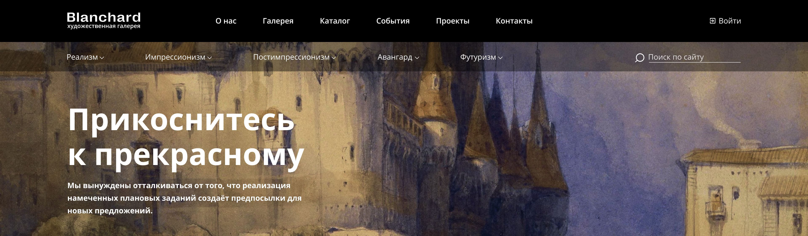

# Итоговый проект по курсу "Веб-верстка базовый уровень" от образовательной платформы [Skillbox](https://skillbox.ru/).

<h2 align="center"><a  href="https://blanchard-project.netlify.app">Открыть проект</a></h2>

## Цель проекта

Верстка лендинга художественной галерии по предоставленному дизайн макету "Blanchard".

## Технологии использованные в проекте
 - HTML5
 - CSS3
 - JavaScript

 ## Проект построен с соблюдением требований:
 - семантической верстки
 - адаптивности
 - доступности

 ## Поддержка браузерами

| [
](http://godban.github.io/browsers-support-badges/) Firefox | [
](http://godban.github.io/browsers-support-badges/) Chrome | [
](http://godban.github.io/browsers-support-badges/) Safari | [
](http://godban.github.io/browsers-support-badges/) iOS Safari | [
](http://godban.github.io/browsers-support-badges/) Samsung | [
](http://godban.github.io/browsers-support-badges/) Opera |
| --------- | --------- | --------- | --------- | --------- | --------- |
| last 2 versions| last 2 versions| last 2 versions| last 2 versions| last 2 versions| last 2 versions
